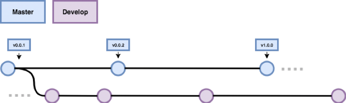
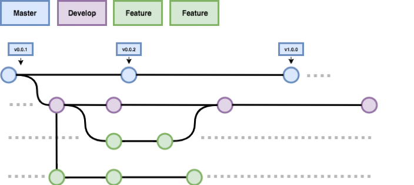
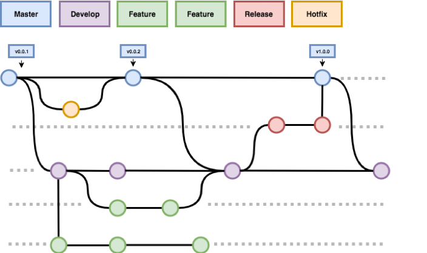

# Git / BitBucket best practice & developer guidelines - 1.0.0 

## BitBucket

### Open first policy
By default all projects and repositories SHOULD be available for all staff BitBucket users to read. Write access MAY be locked down to particular teams on an project or repository basis. Read access can only be removed from all users under special circumstances.

This policy is designed to encourage collaboration between teams. Any developer in any team should be encouraged to read code that other teams are the custodians of, and suggest changes to improve the quality of that code. 

Storing sensitive information such as keys, tokens or passwords in the repositories is not a valid reason for breach of this policy. This type of config MUST be separated from the code. Refer to 12factor app for further information on this factor: https://12factor.net/config 

> A litmus test for whether an app has all config correctly factored out of the code is whether the codebase could be made open source at any moment, without compromising any credentials. 

### Naming Conventions
Project and repository naming conventions MUST be followed. The goal is to keep consistency in BitBucket so that developers implicitly know where to find code. 

#### Project Naming Conventions
Projects should only be created when there is a need to logically group a series of repositories. Valid reasons for creating a project MAY include; new services or products. 

The name of a project MUST semantically represent the repositories included in the project. A new developer at SHOULD be able to derive what’s contained in a project by simply reading the name of the project. 

The use of full English words in project names SHOULD be encouraged over acronyms. Project names MUST follow Title Case style. 

All projects MUST contain a short project description. Limit this to a few sentences at most. The description SHOULD be a logical description of the purpose of the project and further hint at the types of repositories found within. 

It is RECOMMENDED that all projects contain a project avatar. This will help developers visually locate projects in the BitBucket interface. 

#### Repository Naming Conventions
In Bitbucket a repository name determines the URL it is accessed through. The following guidelines SHOULD be followed in order to keep consistency with repository names on BitBucket. 

It is RECOMMENDED that a repository name convey what the code in the repository is used for. 

Repository names SHOULD be written in Type Case style (BitBucket will lowercase and replace spaces with hyphens). 

Special characters such as apostrophes SHOULD be avoided (as they will be replaced by hyphens). 

Version information MUST NOT be included in the name of the repository. This information should be contained to branches or tags. 

#### Repositories that don't belong in a project
Repositories that are single use, testing grounds, research & development or for hack days should not be placed in a Business Units project space. BitBucket has the facility to create repositories that are owned by the authenticated user. Use these repositories to create a space that's used for exploring new code, ideas, and structure.

If the code in the repository becomes something that should be pushed to production it MUST be moved from your account to a project following the best practice outlined. 

### Repositories
Repositories encapsulate the code for a service or library. Git is the preferred Version Control System.

Engineers SHOULD be encouraged to upload their public SSH key to their BitBucket account and SHOULD use SSH as the protocol for Git communication. 

HTTPS MUST NOT be used in any automated process or workflow that integrates with BitBucket. This is to avoid personal accounts being used when service accounts via SSH is the correct method. 

The following rules MUST be adhered to when working with Git repositories 

1. The repository naming conventions outlined in this document MUST be followed. 
2. Repositories MUST contain a README.md file in the root of the project. 
3. The README.md file MUST outline how to build the library or application and SHOULD provide a quick-start for developers to get started modifying the code. README.md SHOULD be updated in each branch to reflect branch specific information. 
4. Each repository SHOULD have a self contained a build process which can be used to build the library or application. 
5. Repositories MUST contain a master and develop branch. Branch permissions in BitBucket MUST be configured to only allow Fast Forward commits from an approved Pull Request into master and develop branches. In summary you MUST NOT push a commit directly to a master or develop branch unless there are special circumstances.
6. 3rd party dependencies MUST NOT be committed into the repository. The usage of a Dependency Management tools available in all popular languages SHOULD be encouraged. Modifying 3rd party dependencies is not a valid reason for breaching this policy. See 3rd party dependencies section of this document for further information. 
7. Compiled files MUST NOT be committed into the repository. This applies to the compression, minification or packing of any source code. A documented build process SHOULD be used in place of committing these files. 
8. Large binary files SHOULD NOT be committed into the repository. Large files can impact the performance of Git. Therefore adding these to a repository should be avoided. 
9. Sensitive information such as keys, tokens or passwords MUST NOT be committed into the repository.
10. Multiple versions of an application or library MUST be tracked in the same repository using tags or branches. It is not acceptable to start work on a new version of an application or library by creating a new repository. 

## Git Workflow
In order to increase consistency across teams, a standard git workflow should be adhered to. Over the past 5 years gitflow has become the most popular branching strategy used by the Git development community. Adopting this branching strategy will not only increase internal consistency but also ensure our branching strategy is familiar to new hires. 

In order to fimiliarise with gitflow I would suggest reading the following references: 

- The original gitflow post http://nvie.com/posts/a-successful-git-branching-model/ 
- Atlassian explanation of gitflow https://www.atlassian.com/git/tutorials/comparing- workflows#!gitflow-workflow 

### Gitflow

#### Master / Develop 
A single central repository MUST be configured with two long running branches master and develop. Master represents the offical release history. Genearlly the HEAD of master SHOULD represent the production code of a system (in a Continuous Dilivery model) or the latest tag of a release in a release based model. 

#### Feature Branches 

Features MUST be developed in branches. Feature branches MUST be branched of develop and follow the naming convention feature/*, feature-*, sprint/* or sprint-*. Feature branchs MAY be branched off other features. When a feature is complete a Pull Request MUST be created to merge the feature back into the develop branch. Feature branches MUST NOT interact directly with master. 



#### Release Branches 
Once develop has been tested and acquired enough changes for release, a release branch MAY be created. Release branches MUST be forked off develop and follow the naming convention release/* or release-*. From that point new functionality MUST NOT be added to the release branch, only bug fixes, documentation and release ready commits. 

When the release is ready for shipping it MUST be merged into master and master tagged with the version number of the release. The release branch SHOULD also be merged back into develop. 

#### Hotfix Branches
Hotfix branches are used to patch master. They MUST NOT be long running. A hotfix SHOULD branch directly off master. Once tested and ready for deploy they MUST be merged back into master. Once master is updated master should be used to refresh develop and any release branch that is in preparation for release. If hotfix is used to refresh develop directly, develop will be missing the merge commit that was created when hotfix was merged into master.


### Gitflow Lite
Giflow offers a standard way for teams to interact with git. As stated, this can have the benefit of increased interoperability and implied knowledge for new hires. However, some teams that implement a Continuous Delivery model (build websites, HTTP APIs etc) complain that the addition of release branches adds unnecessary overhead. 

The release branch best suits projects that are packaged into well defined releases. This could include libraries that would published to NPM or Packagist, mobile app builds, and desktop app builds. 

If teams feel that release branches add too much overhead they MAY implement the gitflow lite workflow. 

Gitflow lite is essentially the same as gitflow _minus release branches_. Once the develop branch has been tested and is ready for release it is merged directly into master and pushed to production. Simple. 

#### What if you need to hotfix a release? 
If your team is using gitflow lite but still using a release based methodology you may sometimes need to hotfix a release. Release based methodologies MUST adhere to SemVer 2.0.0. In order to hotfix a release create a branch off the tag of the release that needs to be patched and then follow best practice as outlined. 

### Branch Names
A branch name should be a logical description of the code inside the branch. It is a good idea to follow the Gitflow idioms for branch naming. These are well defined and understood by most developers.

If the branch is related to a ticket or issue in some kind of issue tracking software it is a good idea to include the ticket / issue number in the name of the branch. Don't forget to also include a description of the ticket.

Good

```hotfix/SCRUM-101-fix-forgot-password```

Bad (you have no idea what this branch is for without referencing the ticket)

```hotfix/SCRUM-101```

### Commit messages
Chris Beams has written a [great article](https://chris.beams.io/posts/git-commit/) that goes into depth on the importance of and how to structure git commit messages. It's worth a read. Follow these guidelines. They are summed up as:

1. Separate subject from body with a blank line
2. Limit the subject line to 50 characters
3. Capitalize the subject line
4. Do not end the subject line with a period
5. Use the imperative mood in the subject line
6. Wrap the body at 72 characters
7. Use the body to explain what and why vs. how

If using issue tracking software it is considered best practice to link a git commit to the issue it is addressing. This can be accomplished by using smart commits [https://confluence.atlassian.com/fisheye/using-smart-commits-298976812.html](https://confluence.atlassian.com/fisheye/using-smart-commits-298976812.html).

Use smart commits when possible.

### 3rd Party Dependencies
Developers SHOULD NOT commit 3rd party dependencies to repositories. Every modern language has a dependency management tool. Use them. 

For reasons outlining why you should never do this read the following articles: 

- https://byjoeybaker.com/why-you-should-never-commit-node-modules-in-nodejs 
- https://www.atlassian.com/blog/git/git-project-dependencies
- https://12factor.net/dependencies
- https://getcomposer.org/doc/faqs/should-i-commit-the-dependencies-in-my-vendor-directory.md 

If after reading those you still think you have a valid reason for committing vendor code you MUST first seek approval before committing a 3rd party dependency to a repository. 

Fixing a bug or modifying vendor code is NOT a valid reason to breach this policy. 

#### What to do if you need to modify a 3rd party dependency 
1. Sign in to a Github account 
2. Fork the 3rd party dependency
3. Apply your fix / change in a branch (following the branching strategy of the upstream repository is wise) 
4. Add any tests required by the vendor to accept changes 
5. Use the idiomatic dependency management tool for the language you're working with to depend on the forked of the dependency 
6. Create a Pull Request asking to push the change in the fork back into the vendor repository 
7. If the Pull Request is approved and the change is pushed up-steam you should update your dependency to point back to the 3rd party's repository 

This is describing a very common pattern used in Open Source Software. It has multiple benefits: 
- Code is not diverged for eternity, meaning updating to new releases from the 3rd party is painless
- Positive exposure for yourself
- You are contributing back to the community

If the dependency in question is provided by a vendor as closed source the above should still be followed, however put the code in our private Bitbucket repository. 

## Versioning 
Semantic Versioning has for a long time been the de facto scheme for software version management. Why? It makes sense. It makes sense to both humans and computers. Without a predefined standard for interpreting software versions the exercise is essentially pointless. There is no difference between 123, abc or unicorn unless there is an agreement on the scheme used. 

Following strict guidelines helps give meaning to version numbers. 

The real power of SemVer is demonstrated by the fact that the specification can be implemented and understood by computers. This has meant that dependency managers are able to pull down updates of software packages knowing the update is not going to break the public interface of that software. 

All developers MUST read the excellent (and concise) official SemVer specification http://semver.org/. 

### Semver 
Developers implementing the specification at MUST read the official specification. For other readers of this document looking for a quick introduction to the specification, the SemVer summary is a good staring point: 

Given a version number MAJOR.MINOR.PATCH, increment the: 
1. MAJOR version when you make incompatible API changes,
2. MINOR version when you add functionality in a backwards-compatible manner, and 
3. PATCH version when you make backwards-compatible bug fixes. 

Additional labels for pre-release and build metadata are available as extensions to the MAJOR.MINOR.PATCH format. 

### Policy 
All software that is released under a release methodology (not a Continuous Delivery model) MUST adhere to the official SemVer 2.0.0 specification. 

### When to tag 
Combining Gitflow with SemVer gives developers a common base understanding and powerful workflow. A question is sometimes asked by teams, when should you tag a new version? Generally the answer is simple. Tag the merge commit that is created when the release branch is merged into master. 

A common pattern is as follows: 

1. Release has been tested on release branch and is ready for release 
2. Team creates Pull Request to merge release branch into master (this is a good idea, force FFWD commits on master only and ensure there is a merge commit on that branch for traceability) 
3. Pull Request is approved and merged into master 
4. Tag the release 
    1. If no build script needs to be modified to bump a version number this merge commit can be tagged with the new version 
    2. If a version document needs to be incremented (package.json) this can be done in two ways 
        1. In the initial PR for the merge of release into master 
        2. A new PR that is only for bumping the version number 